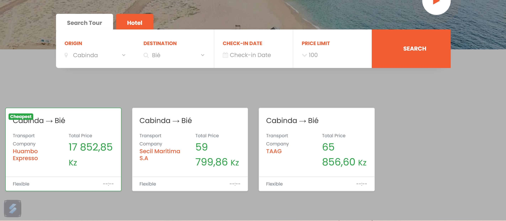

# Academic Project

This is an academic project developed for IT. The goal of this project is to [briefly describe the objective of the project].

## Screenshot

Below is a screenshot of the project, showcasing the homepage:




## Technologies Used

This project utilizes the following technologies:

- **Laravel**: A PHP framework for building web applications.
- **Livewire**: A full-stack framework for Laravel that makes building dynamic interfaces simple.
- **Bootstrap**: A front-end framework for building responsive websites.
- **Blade**: The templating engine used by Laravel.
- **MySQL**: The relational database management system used for storing project data.

## How to Run the Project

To run the project locally, follow these steps:

1. Clone the repository:
   ```bash
   git clone [repository URL]
Install dependencies:


composer install
Configure the .env file:

Adjust the database and other environment variables as necessary.

Run the database migrations:


php artisan migrate
Start the local development server:


php artisan serve
Once the server is running, you can access the application at http://localhost:8000.

Contributing
Contributions are welcome! Please feel free to fork the repository, make changes, and create a pull request.

License
This project is licensed under the MIT License - see the LICENSE file for details.
